# ROM Hub, in about sixty seconds

RomM, Gaseous and Retrom are self-hosted ROM library managers. None of them has
a plugin system: adding a source to any of them means editing its core.

**ROM Hub is that plugin system, running beside them as a sidecar.** It never
modifies the library server. Plugins add sources — searching them, importing
from them, enriching what is already there — and the same plugin works against
all three servers, because a plugin has never known which one is on the other
side.

Everything below was produced against a live three-server stack. Every rom in
every screenshot was placed by a plugin installed by slug from its public git
repo. Nothing was hand-copied, no database was written directly, and no row was
staged for the photograph. Where something is not as good as it looks, it says
so — see [What is not in the pictures](#what-is-not-in-the-pictures).

---

## The one idea

A plugin **describes** work. The host **executes** it.

A plugin holds no credential for a library server, opens no socket, and has no
filesystem mount. Asked to import something, it returns a `FetchPlan` — these
URLs, this platform, this collection. Asked for metadata, it returns a
`MetadataPatch` — this name, and the URL a cover lives at. The host validates
every URL in that answer against the allowlist *the plugin declared in its own
manifest*, fetches the bytes itself, and writes them to whichever backend
`ROM_HUB_BACKEND` selects.

That is why a plugin is backend-agnostic structurally rather than by promise,
and it is the same property that makes an untrusted plugin tractable.

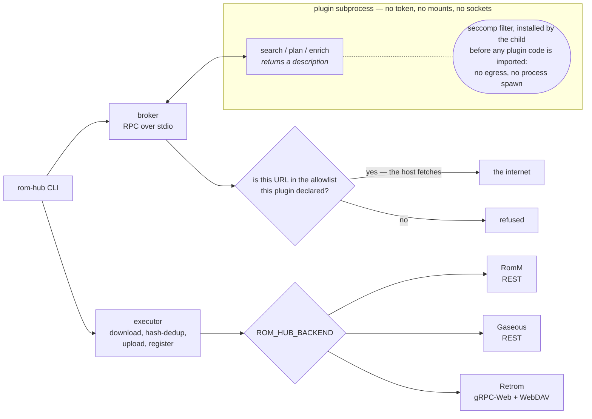

### The sandbox, stated plainly

The plugin subprocess installs a seccomp filter **on itself**, before any plugin
code is imported. Network egress and process spawn are blocked outright, so the
manifest allowlist is enforced rather than advisory — the plugin physically
cannot open a socket, and its only route to the network is an RPC back to the
host, which checks each URL against that same allowlist.

**File reads are not confined.** seccomp cannot filter on a path, so a plugin
can read any file the host process can. The CLI says exactly that at install
time rather than in a footnote. On a host where seccomp is unavailable —
Windows, macOS — plugins **refuse to run** unless `ROM_HUB_ALLOW_UNSANDBOXED=1`
is set, and with it set there is no confinement at all. Everything in this
document was captured on Linux, with the filter active.

### The seven capabilities

| Capability | Command | What a plugin returns |
|---|---|---|
| `search` | `rom-hub search <query>` | search results, fanned out across every enabled plugin at once |
| `importer` | `rom-hub import <plugin> <id>` | a `FetchPlan`: which URLs, which platform, which collection |
| `metadata` | `rom-hub enrich <plugin> <rom_id>` | a `MetadataPatch`: fields to set, and the URL a cover lives at |
| `stream` | `rom-hub stream <plugin> <id>` | a stream target, for items that may be played but not downloaded |
| `cores` | `rom-hub cores list\|install` | emulator cores |
| `firmware` | `rom-hub firmware list\|install` | BIOS files, each with its licence |
| `assets` | `rom-hub assets list\|install` | shaders, overlays, cheats, controller profiles |

### The three backends

`rom-hub backend info` answers without opening a connection, because the person
asking "what can this thing do" is usually asking *because* the connection is
not working yet.

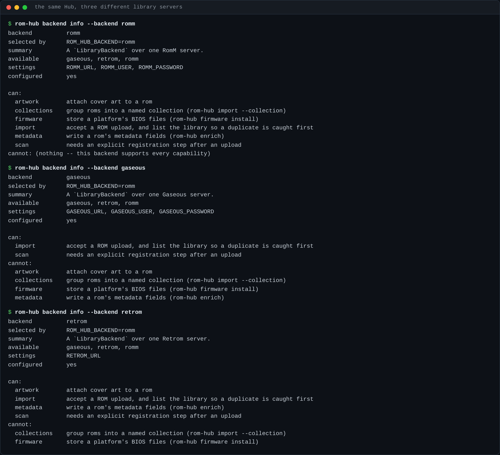

Every row was established from the backend's source and a live run rather than
assumed. Gaseous has no metadata-write API and no collections, so the Hub does
not attempt either and an import reports the skip instead of failing the rom.
Retrom has no collections and no upload API at all — files arrive over WebDAV
and `UpdateLibrary` indexes them.

---

## The plugin system

### The directory: 22 plugins

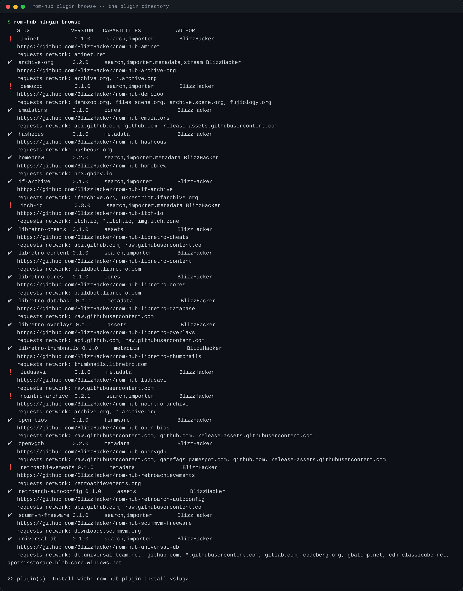

The leading mark is the catalogue's own note on whether a plugin needs a
credential or has terms worth reading before installing.

### Installed, and what confines them

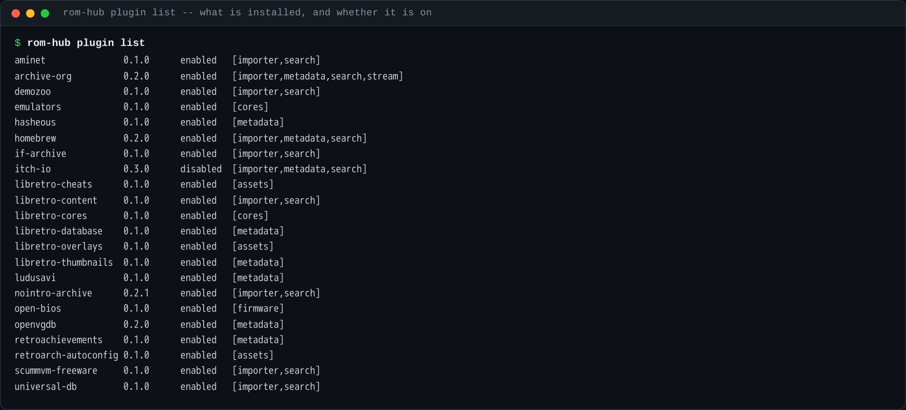

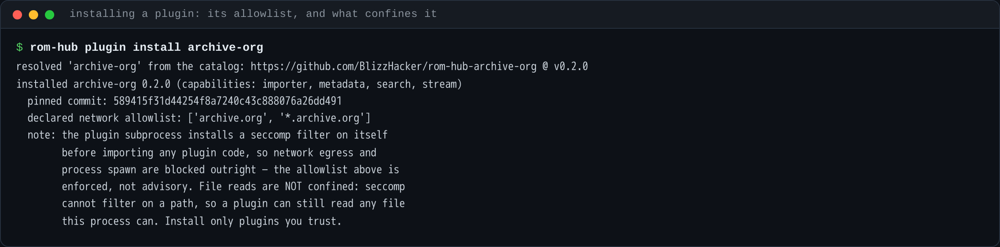

The allowlist is printed at install time, before the first command that would
use it, because "this plugin will talk to `archive.org`" is a thing to learn
while deciding whether to install rather than halfway through a search.

### Turning one off, and back on

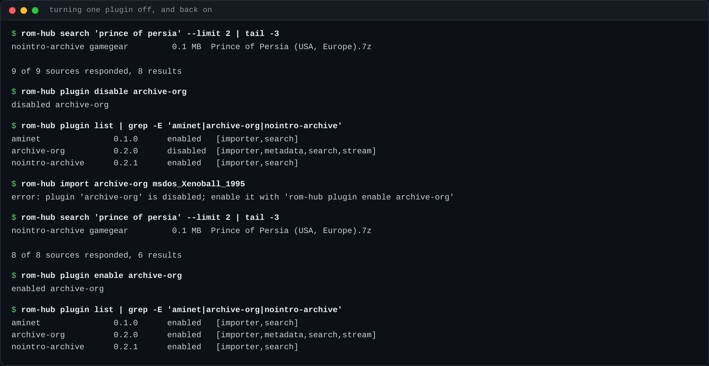

A disabled plugin drops out of the fan-out — the source count falls — and a
command aimed at it directly refuses and names the command that would undo it.
Enabling puts it back with nothing else touched.

### A plugin's own settings

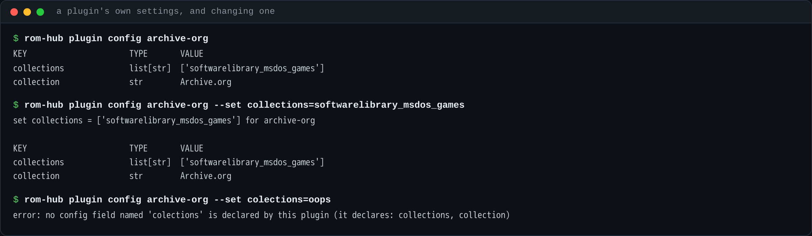

An undeclared field is refused and the refusal names what *is* declared, rather
than writing a key nothing will ever read. A `secret`-typed field is never
printed here whatever it holds, and `--set` refuses one outright rather than
writing it to `state.json` — it names `plugin secret set`, which puts it in the
OS keyring instead.

**The secret refusal is not in the picture, because nothing on the stack had a
secret to protect.** At the versions installed when these captures were taken,
none of the 22 declared a `secret`-typed config field: `retroachievements`
v0.1.0 kept its API key as a plain `str`, on the strength of a manifest comment
saying the host rejected `secret` — true when that plugin was written and no
longer. So the refusal is covered by tests rather than by a screenshot. The
catalogue pin has since moved to `retroachievements` v0.2.0, which does declare
it `secret`; that is the commit below this one on this branch, and it landed
after the captures.

### One query, every source at once

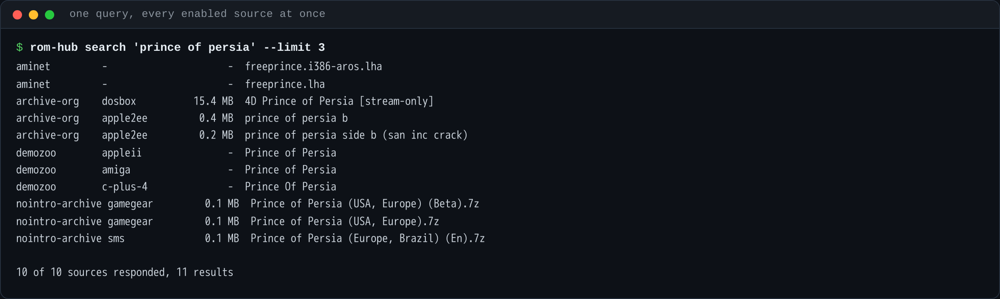

Each plugin runs in its own subprocess and its own thread, so one that fails
costs its own results and nothing else. That is why the last line is *N of M
sources responded* rather than a single error. Stream-only items are flagged,
because they can be played but not imported, and the importer refuses them
rather than handing anyone a URL to try by hand.

### An import, end to end

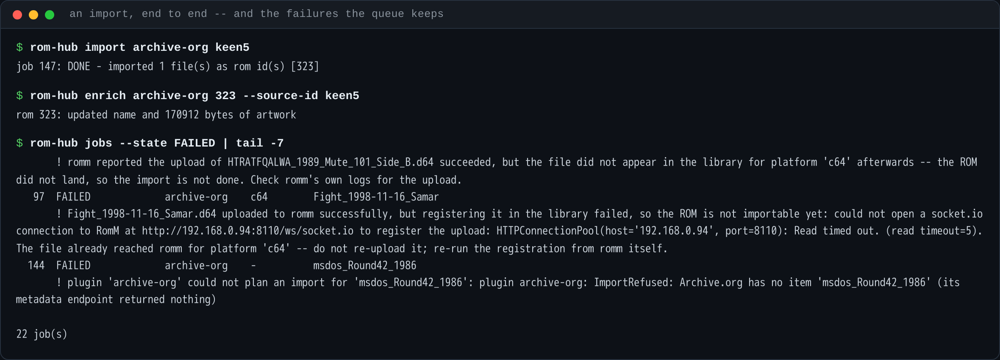

Plan → download → hash-dedup against the library → upload → register → group
into a collection. The job survives a restart, and `rom-hub jobs` shows the
failures as well as the successes.

### The capabilities that are not the library

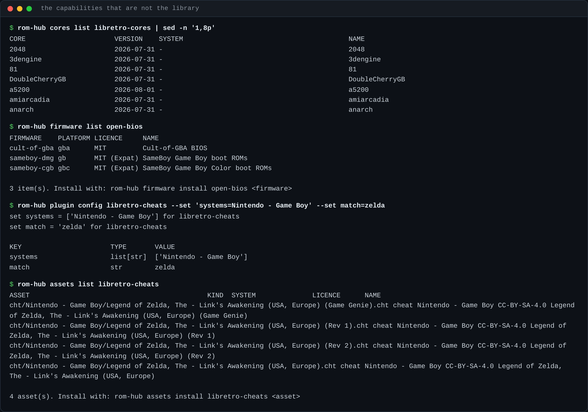

`firmware list` and `assets list` print each item's licence, because a BIOS file
is not a ROM and the difference between "freely redistributable" and "not" is
the operator's to know before installing, not after.

---

## The libraries these plugins filled

### RomM

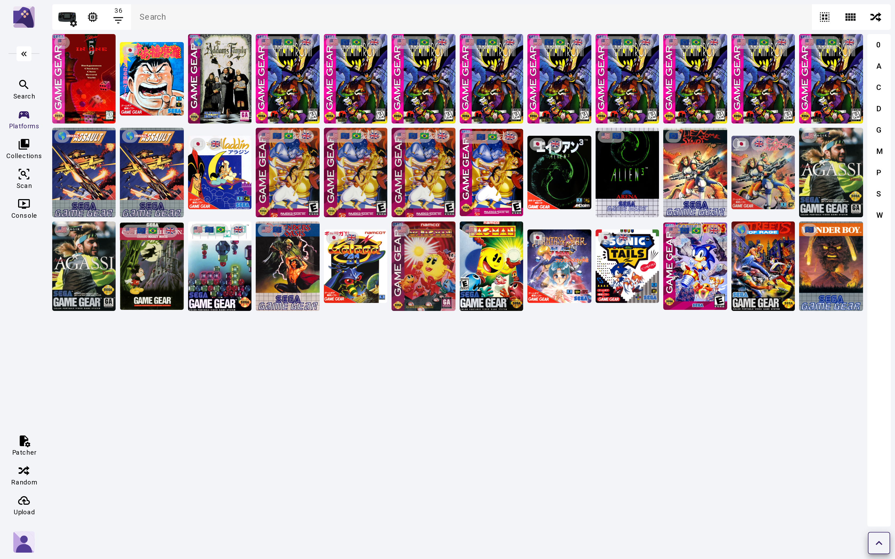

Game Gear, imported by `nointro-archive` and given its box art by
`libretro-thumbnails`. This is the densest real-artwork view in the library and
it is the one worth judging the art pipeline on — most of the rest of the
library is DOS, Amiga and C64, where the art is a title-screen capture.

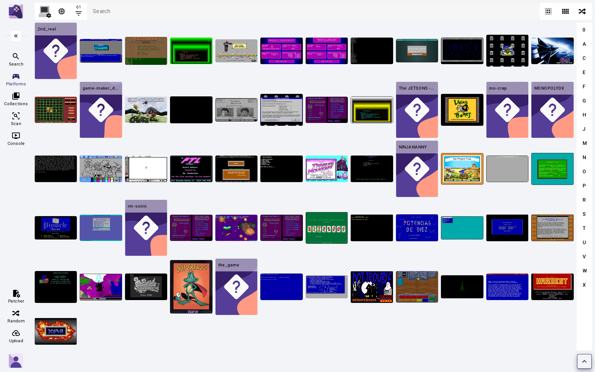

DOS, from `archive-org`. Every cover here came out of the item's own file list —
mostly emulator screenshots, occasionally a real `00_coverscreenshot` scan. The
`?` tiles are items that carry no image at all.

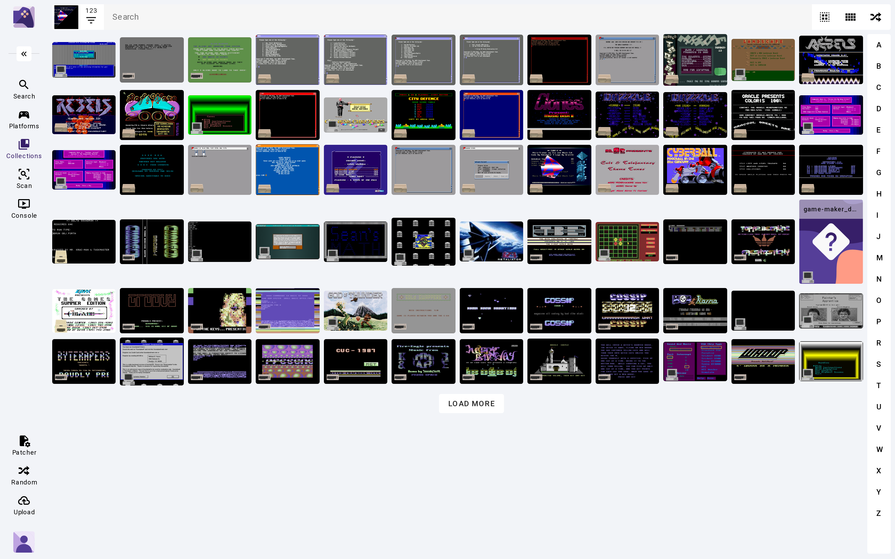

The `archive-org` collection, 123 items. Each collection in this library is
named after the plugin that filled it — Aminet, Archive.org, Demozoo, Homebrew,
IF Archive, libretro content, No-Intro, ScummVM freeware — because the plugin's
`FetchPlan` names it and the host creates it.

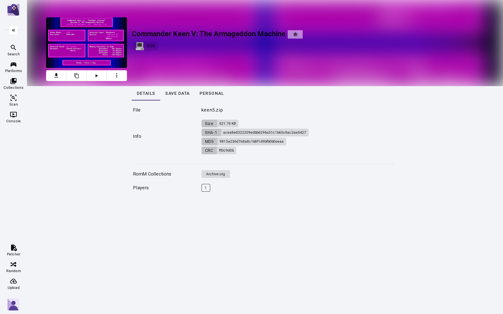

The name and the cover on this page were both written by `archive-org` through
`rom-hub enrich`; the file underneath it was downloaded and uploaded by the same
plugin's `FetchPlan`.

### Gaseous

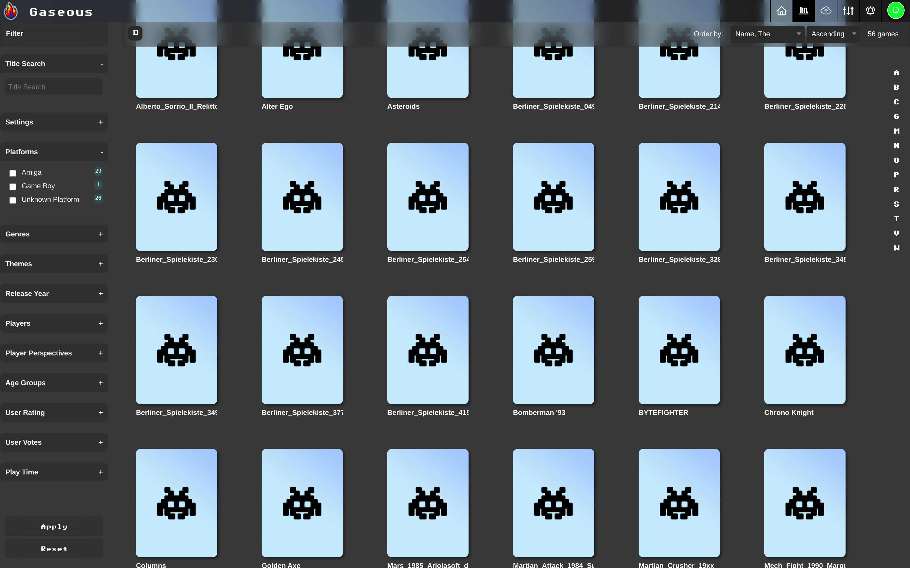

Same plugins, different server, and the differences are structural rather than
cosmetic.

**Every tile here is a placeholder, and that is the honest outcome.** Gaseous
exposes no metadata-write API, so the Hub never writes a cover — `capabilities()`
declares that, and the host does not try. Gaseous's own IGDB lookup (its
credentials *are* configured on this stack) matched none of these titles either,
because Amiga public-domain disks and DOS shareware are not in IGDB. The
placeholder is Gaseous's.

Note the platform facet: 29 Amiga, 1 Game Boy, 26 **Unknown Platform**. Gaseous
derives a rom's platform from its own file signature and discards the one the
upload asked for, so anything not in a signature database lands on platform 0.
That is documented upstream behaviour, not a ROM Hub bug, and `list_roms` widens
to platform 0 precisely because of it.

### Retrom

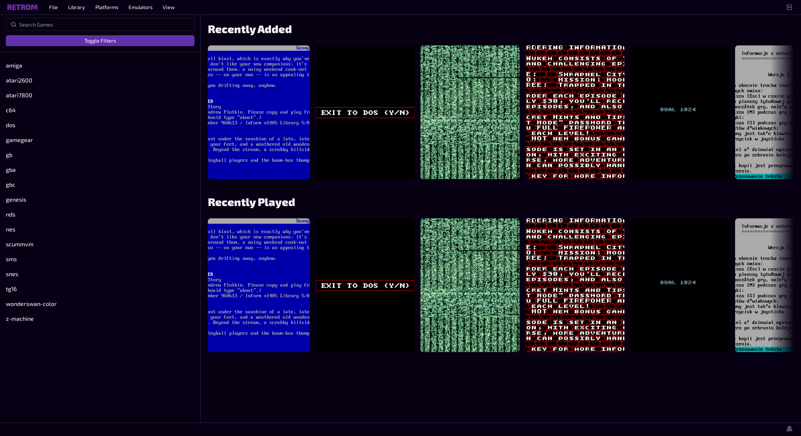

Retrom's web client has no grid view — this *is* its library screen, and the
platform list down the left is what these plugins created. Retrom accepts
metadata and artwork, so the covers here **were** written by a plugin through
the Hub: they are the Archive.org items' own emulator screenshots, which is what
those items carry. Retrom has no upload API at all; the files arrived over
WebDAV and `UpdateLibrary` indexed them.

---

## What is not in the pictures

### Cover art is partial, and this is the real number

`scripts/showcase_stats.py` reads these off the servers rather than from a tally
kept while importing. Captured 2026-08-01, against RomM 4.9.2, Gaseous 2.0.0-rc.3
and Retrom 0.8.4 running side by side:

| Backend | Roms | With cover art | Ratio |
|---|---:|---:|---:|
| RomM | **324** | **231** | **71.3 %** |
| Retrom | 81 | 52 | 64.2 % |
| Gaseous | 56 | — | the Hub cannot write art here |

**461 roms in total**, every one placed by a plugin. Per RomM platform, the
spread is wide and it explains the average:

| Platform | Roms | With cover | Where the art came from |
|---|---:|---:|---|
| Game Gear | 36 | **36** | `libretro-thumbnails` box art |
| Master System | 12 | 12 | `libretro-thumbnails` |
| Atari 2600 / 5200 / 7800 | 18 | 18 | `libretro-thumbnails` |
| Mega Drive | 30 | 24 | `libretro-thumbnails` |
| DOS | 61 | 53 | `archive-org`, mostly screenshots |
| Amiga | 42 | 35 | `archive-org` |
| C64 | 46 | 31 | `archive-org` |
| Game Boy / Color / Advance | 28 | 1 | homebrew — no art database carries it |
| NES / SNES | 13 | 0 | homebrew, same reason |
| ScummVM, Z-machine, Glulx | 12 | 0 | interactive fiction and adventure engines |

Covers come from four plugins with different reach. `libretro-thumbnails` has
genuine box art, but only for titles under their No-Intro names. `archive-org`
takes whatever the item itself carries — sometimes a real `00_coverscreenshot`
scan, more often an emulator screenshot of the title screen, which fills the
grid with a picture but is not box art and is not claimed as one. `openvgdb` and
`libretro-database` mostly correct names rather than supply art.

Demoscene productions, interactive fiction and homebrew have no art anywhere,
because no art database carries them. A library with a cover on every tile would
be a smaller and far less interesting library.

### Some of these roms are catalogued, not playable

RomM's web player maps a platform slug to an EmulatorJS core, and **it has no
core for every platform it will happily store a rom under**. A rom filed under
one of those appears in the library and does nothing when clicked.

`scripts/showcase_playable.py` reports the split, and it hardcodes nothing: it
reads the `slug -> [core]` map out of the running RomM server's own frontend
bundle, so it describes the server in front of you. For this library:

```
RomM's player has a core for 78 platform slugs
308 roms on a platform the player can run
16 roms catalogued only -- no core, so the player will not start them
```

The import batches were deliberately weighted toward the playable list once that
audit existed — which is why there are 36 Game Gear roms and three Apple II ones
rather than the other way round.

Sources that are inherently catalogue-only in RomM:

* **`scummvm-freeware`** targets `scummvm`, and RomM's player has no ScummVM core.
* **`if-archive`** targets `z-machine` and `glulx` — interactive fiction, no core.
* **`archive-org`'s Apple II, Apple IIGS, Atari 8-bit and Atari ST** mappings
  likewise. The batch here was deliberately weighted away from them.

One upstream quirk worth naming: RomM's core map keys ZX Spectrum as **`zsx`**
while its own platform slug is **`zxs`**, so a Spectrum rom is unplayable in its
player through a two-letter transposition inside RomM. Verifiable in the bundle;
nothing a sidecar can fix.

### Imports that failed, and one class that was our own fault

`rom-hub jobs` shows failures rather than hiding them, and the batches that
filled this library produced real ones: Archive.org 502s and 500s on individual
downloads, one DNS blip, and items whose emulator id is not in the plugin's
platform table — which is a deliberate refusal, since guessing files a rom under
the wrong system and nothing afterwards ever says something went wrong.

One class was self-inflicted. RomM registers an uploaded file by running a scan,
and **two scans in flight lose roms**: the file is written, the scan that would
create its database row is dropped, and the import correctly fails its own
post-condition with *"uploaded successfully, but the file did not appear in the
library"*. Running two import batches against one RomM at once is what caused
it. Those roms were picked up by a later scan and are in the library, but their
jobs are `FAILED` and they were never added to their collection — so the
Archive.org collection holds fewer roms than the archive-org plugin actually
imported. Import batches against one server must be serial; the later runs were,
and produced none of these.

### Three Apple II roms that should not be there

The archive-org batch was stopped once the platform audit showed Apple II has no
core, but three had already landed. They are still in the library, counted in
the catalogue-only figure, and left in place rather than deleted straight out of
the database.

### Plugins that are installed and did nothing here

* `retroachievements` — needs a web API key the demo stack had none for. It
  refused cleanly rather than half-working.
* `ludusavi` — matches PC-game titles exactly; nothing in this library matched,
  which is the conservative behaviour it is built for.
* `itch-io` — answers the fan-out search but cannot import: `robots.txt` forbids
  its download path, and every platform it targets is one RomM's player has no
  core for. Deliberately not imported from.

### Server setup that is not plugin work

Platforms and accounts are not content, and no plugin creates them. The demo
RomM's platform records and library directories were created with `POST
/api/platforms` and `mkdir`, and the first accounts on RomM and Gaseous were
created through each server's own first-run route — see
`scripts/proof-stack-bootstrap.sh`. **No rom, cover, name or collection
membership was created that way.**

### There is no CLI for everything

`rom-hub plugin config --set` exists as of this branch, because before it a
plugin could declare a config field that nothing but hand-editing `state.json`
could reach. `scripts/showcase_discover.py` exists because `rom-hub search`
prints a human-readable table with no `source_id` column, so its output cannot
be piped into `rom-hub import`. That is a real gap; the script calls the same
`dispatcher.search_all` the CLI does rather than routing around it.

---

## Reproducing this

Every script used is committed under `scripts/`:

| Script | What it does |
|---|---|
| `showcase_discover.py` | prints `source_id`s from a plugin search, so a bulk import can be scripted |
| `showcase_enrich.py` | walks roms with no cover, trying each metadata plugin in turn, by shelling out to `rom-hub enrich` |
| `showcase_stats.py` | rom counts and the cover-art ratio, read from the servers |
| `showcase_playable.py` | playable vs catalogue-only, against RomM's own core map |
| `term_capture.py` | runs a command and records its real output |
| `term_shot.py` | renders a recorded session to a PNG — it can render, never edit |
| `shoot.py` | screenshots a backend's UI at a named route, and reports what it saw |
| `proof-stack-bootstrap.sh` | first-run accounts and platforms for a disposable stack |

`term_capture.py` and `term_shot.py` are deliberately two programs. One runs
commands and writes down what came back; the other renders a file it is handed.
Nothing between the command and the PNG can retouch the output.
